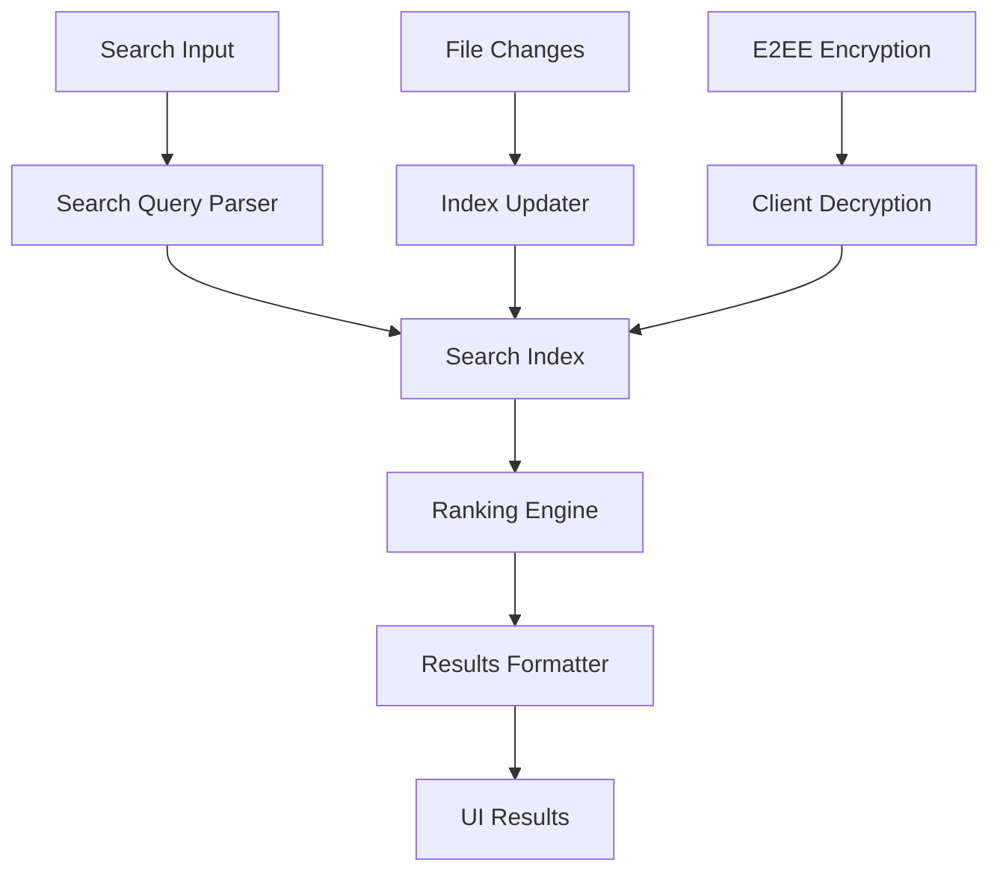

# E2EE-Compatible Client-Side Search Implementation Plan

**Date:** January 2025  
**Project:** TextNotepad.com  
**Goal:** Implement robust client-side search that seamlessly transitions to E2EE encryption  

---

## 📋 Executive Summary

This plan outlines the implementation of a client-side search system that works today with unencrypted data and seamlessly transitions to full E2EE encryption without breaking changes. The approach prioritizes privacy-first design while maintaining excellent user experience.

---

## 🎯 Key Objectives

### Primary Goals
- ✅ **Privacy-First:** All search processing happens on client (E2EE ready)
- ✅ **Performance:** Fast search for up to 10,000+ notes
- ✅ **User Experience:** Instant results with smart highlighting
- ✅ **Future-Proof:** Zero breaking changes when E2EE is added
- ✅ **Scalable:** Efficient indexing that works offline

### Success Metrics
- Search response time < 100ms for 1,000 notes
- Full-text search across all note content
- Supports complex queries (AND, OR, quotes)
- Works offline (client-side processing)
- Highlighting and context snippets

---

## 🏗️ Current Architecture Analysis

### ✅ What's Already Built
```typescript
// Existing Components Found:
- SearchInterface.tsx        // Basic UI with filtering
- useGlobalSearch.ts         // Simple string matching
- useFiles.ts               // Data fetching layer
- App selection system      // Navigation/state management
```

### 🔍 Current Search Implementation Review

**Strengths:**
- ✅ Client-side processing (E2EE compatible)
- ✅ Good UI with filters and highlighting  
- ✅ Debounced search (300ms)
- ✅ Contextual snippets

**Limitations:**
- ❌ Basic string matching only (no fuzzy search)
- ❌ No search indexing (O(n) performance)
- ❌ Limited query syntax support
- ❌ No advanced ranking/relevance
- ❌ No search analytics/optimization

---

## 🚀 Enhanced Search Architecture

### Core Components



### 1. **Search Index Layer** (New)
```typescript
interface SearchIndex {
  // Inverted index for fast lookups
  terms: Map<string, Set<string>> // term -> fileIds
  files: Map<string, IndexedFile>  // fileId -> metadata
  ngrams: Map<string, Set<string>> // ngram -> fileIds (fuzzy search)
}

interface IndexedFile {
  id: string
  title: string
  content: string
  lastModified: number
  wordCount: number
  terms: string[]
  // E2EE ready - all content stays local
}
```

### 2. **Query Parser** (New)
```typescript
interface ParsedQuery {
  terms: string[]
  phrases: string[]      // "exact phrases"
  mustHave: string[]     // +required
  mustNotHave: string[]  // -excluded
  filters: QueryFilter[]
}

interface QueryFilter {
  type: 'date' | 'wordCount' | 'folder' | 'tag'
  operator: 'gt' | 'lt' | 'eq' | 'contains'
  value: string | number
}
```

### 3. **Ranking Algorithm** (Enhanced)
```typescript
interface SearchResult {
  file: UserFile
  score: number
  highlights: HighlightRegion[]
  snippets: ContentSnippet[]
}

interface HighlightRegion {
  start: number
  end: number
  term: string
  field: 'title' | 'content'
}
```

---

## 📊 E2EE Compatibility Strategy

### Phase 1: Client-Side Foundation (This Week)
- **All processing on client** - ready for E2EE
- **Local indexing** - no server dependencies  
- **Encrypted storage** - prepare for E2EE storage

### Phase 2: E2EE Integration (Future)
```typescript
// E2EE Flow (Future Implementation)
const searchE2EEFiles = async (query: string): Promise<SearchResult[]> => {
  // 1. Fetch encrypted files from server
  const encryptedFiles = await fetchEncryptedFiles()
  
  // 2. Decrypt on client using user key
  const decryptedFiles = await Promise.all(
    encryptedFiles.map(file => decryptFile(file, userKey))
  )
  
  // 3. Search decrypted content (same as current implementation)
  return searchFiles(decryptedFiles, query)
}
```

### Privacy Guarantees
- 🔒 **Search terms never leave client**
- 🔒 **Content decryption only on client**
- 🔒 **Index stored locally (IndexedDB)**
- 🔒 **Zero server-side search dependencies**

---

## 🛠️ Implementation Plan

### Week 1: Core Search Engine

#### Day 1: Search Index Foundation
```typescript
// Create: src/lib/search/SearchIndex.ts
class SearchIndex {
  private index: Map<string, Set<string>>
  private files: Map<string, IndexedFile>
  
  constructor() {
    this.index = new Map()
    this.files = new Map()
  }
  
  addFile(file: UserFile): void {
    const terms = this.extractTerms(file.content)
    const fileId = file.id
    
    // Build inverted index
    terms.forEach(term => {
      if (!this.index.has(term)) {
        this.index.set(term, new Set())
      }
      this.index.get(term)!.add(fileId)
    })
    
    // Store file metadata
    this.files.set(fileId, {
      id: fileId,
      title: file.name,
      content: file.content,
      lastModified: new Date(file.updated_at).getTime(),
      wordCount: file.word_count || 0,
      terms
    })
  }
  
  search(query: string): string[] {
    const terms = this.extractTerms(query)
    if (terms.length === 0) return []
    
    // Find intersection of files containing all terms
    let results = this.index.get(terms[0]) || new Set()
    
    for (let i = 1; i < terms.length; i++) {
      const termFiles = this.index.get(terms[i]) || new Set()
      results = new Set([...results].filter(id => termFiles.has(id)))
    }
    
    return Array.from(results)
  }
  
  private extractTerms(text: string): string[] {
    return text
      .toLowerCase()
      .replace(/[^\w\s]/g, ' ')
      .split(/\s+/)
      .filter(term => term.length > 2)
  }
}
```

#### Day 2: Query Parser & Advanced Search
```typescript
// Create: src/lib/search/QueryParser.ts
class QueryParser {
  parse(queryString: string): ParsedQuery {
    const query: ParsedQuery = {
      terms: [],
      phrases: [],
      mustHave: [],
      mustNotHave: [],
      filters: []
    }
    
    // Parse quoted phrases: "exact phrase"
    const phraseRegex = /"([^"]+)"/g
    let match
    while ((match = phraseRegex.exec(queryString)) !== null) {
      query.phrases.push(match[1])
      queryString = queryString.replace(match[0], '')
    }
    
    // Parse required terms: +required
    const requiredRegex = /\+(\w+)/g
    while ((match = requiredRegex.exec(queryString)) !== null) {
      query.mustHave.push(match[1])
      queryString = queryString.replace(match[0], '')
    }
    
    // Parse excluded terms: -excluded  
    const excludedRegex = /-(\w+)/g
    while ((match = excludedRegex.exec(queryString)) !== null) {
      query.mustNotHave.push(match[1])
      queryString = queryString.replace(match[0], '')
    }
    
    // Parse remaining terms
    query.terms = queryString
      .trim()
      .split(/\s+/)
      .filter(term => term.length > 0)
    
    return query
  }
}
```

#### Day 3: Ranking & Relevance Algorithm
```typescript
// Create: src/lib/search/RankingEngine.ts
class RankingEngine {
  rank(fileIds: string[], query: ParsedQuery, index: SearchIndex): SearchResult[] {
    return fileIds
      .map(fileId => this.scoreFile(fileId, query, index))
      .filter(result => result.score > 0)
      .sort((a, b) => b.score - a.score)
  }
  
  private scoreFile(fileId: string, query: ParsedQuery, index: SearchIndex): SearchResult {
    const file = index.getFile(fileId)
    if (!file) return { file: null as any, score: 0, highlights: [], snippets: [] }
    
    let score = 0
    const highlights: HighlightRegion[] = []
    
    // Title matches get higher score
    const titleMatches = this.findMatches(file.title, query.terms)
    score += titleMatches.length * 10
    highlights.push(...titleMatches.map(m => ({ ...m, field: 'title' as const })))
    
    // Content matches
    const contentMatches = this.findMatches(file.content, query.terms)
    score += contentMatches.length * 1
    highlights.push(...contentMatches.map(m => ({ ...m, field: 'content' as const })))
    
    // Phrase matches get bonus score
    query.phrases.forEach(phrase => {
      if (file.content.toLowerCase().includes(phrase.toLowerCase())) {
        score += 15
      }
    })
    
    // Recency bonus (newer files score higher)
    const daysSinceModified = (Date.now() - file.lastModified) / (24 * 60 * 60 * 1000)
    score += Math.max(0, 5 - daysSinceModified * 0.1)
    
    return {
      file: file as any, // Convert IndexedFile to UserFile
      score,
      highlights,
      snippets: this.extractSnippets(file.content, query.terms)
    }
  }
  
  private findMatches(text: string, terms: string[]): HighlightRegion[] {
    const matches: HighlightRegion[] = []
    const lowerText = text.toLowerCase()
    
    terms.forEach(term => {
      const lowerTerm = term.toLowerCase()
      let startIndex = 0
      
      while (true) {
        const index = lowerText.indexOf(lowerTerm, startIndex)
        if (index === -1) break
        
        matches.push({
          start: index,
          end: index + term.length,
          term
        })
        
        startIndex = index + 1
      }
    })
    
    return matches
  }
  
  private extractSnippets(content: string, terms: string[]): ContentSnippet[] {
    // Extract contextual snippets around matches
    const snippets: ContentSnippet[] = []
    const lines = content.split('\n')
    
    lines.forEach((line, lineIndex) => {
      const hasMatch = terms.some(term => 
        line.toLowerCase().includes(term.toLowerCase())
      )
      
      if (hasMatch) {
        const start = Math.max(0, lineIndex - 1)
        const end = Math.min(lines.length, lineIndex + 2)
        const context = lines.slice(start, end).join('\n')
        
        snippets.push({
          text: context,
          lineNumber: lineIndex,
          hasHighlight: true
        })
      }
    })
    
    return snippets.slice(0, 3) // Limit to 3 snippets per file
  }
}
```

#### Day 4: Enhanced Search Hook
```typescript
// Update: src/hooks/useEnhancedSearch.ts
import { useState, useEffect, useMemo, useRef } from 'react'
import { useFilesList } from './useFiles'
import { SearchIndex } from '@/lib/search/SearchIndex'
import { QueryParser } from '@/lib/search/QueryParser'
import { RankingEngine } from '@/lib/search/RankingEngine'

export function useEnhancedSearch() {
  const [searchQuery, setSearchQuery] = useState('')
  const [isSearching, setIsSearching] = useState(false)
  const { data: files = [] } = useFilesList()
  
  // Initialize search components
  const searchIndex = useRef(new SearchIndex())
  const queryParser = useRef(new QueryParser())
  const rankingEngine = useRef(new RankingEngine())
  
  // Build/update search index when files change
  useEffect(() => {
    const activeFiles = files.filter(f => !f.deleted_at)
    searchIndex.current.clear()
    
    activeFiles.forEach(file => {
      searchIndex.current.addFile(file)
    })
  }, [files])
  
  // Perform search
  const searchResults = useMemo(() => {
    if (!searchQuery.trim()) return []
    
    const parsedQuery = queryParser.current.parse(searchQuery)
    const fileIds = searchIndex.current.search(searchQuery)
    const rankedResults = rankingEngine.current.rank(fileIds, parsedQuery, searchIndex.current)
    
    return rankedResults
  }, [searchQuery])
  
  // Search performance analytics
  const searchStats = useMemo(() => {
    const start = performance.now()
    const results = searchResults
    const end = performance.now()
    
    return {
      resultCount: results.length,
      searchTime: end - start,
      indexSize: searchIndex.current.size
    }
  }, [searchResults])
  
  return {
    searchQuery,
    setSearchQuery,
    searchResults,
    isSearching,
    searchStats,
    hasResults: searchResults.length > 0,
    hasQuery: searchQuery.trim().length > 0
  }
}
```

#### Day 5: Performance Optimization
```typescript
// Create: src/lib/search/SearchOptimizer.ts
class SearchOptimizer {
  // Implement fuzzy search for typos
  fuzzySearch(term: string, threshold: number = 0.8): string[] {
    // Levenshtein distance algorithm
    // N-gram matching for partial matches
  }
  
  // Implement search result caching
  private cache = new Map<string, SearchResult[]>()
  
  searchWithCache(query: string): SearchResult[] {
    if (this.cache.has(query)) {
      return this.cache.get(query)!
    }
    
    const results = this.performSearch(query)
    this.cache.set(query, results)
    
    // LRU cache eviction
    if (this.cache.size > 100) {
      const firstKey = this.cache.keys().next().value
      this.cache.delete(firstKey)
    }
    
    return results
  }
  
  // Implement incremental search
  incrementalSearch(previousQuery: string, newQuery: string): SearchResult[] {
    // If new query extends previous query, filter previous results
    // Much faster than full re-search
    if (newQuery.startsWith(previousQuery)) {
      const previousResults = this.cache.get(previousQuery) || []
      return this.filterResults(previousResults, newQuery)
    }
    
    return this.searchWithCache(newQuery)
  }
}
```

### Week 2: UI Enhancement & Integration

#### Day 6-7: Enhanced Search UI
```typescript
// Update: src/components/app3/EnhancedSearchInterface.tsx
export function EnhancedSearchInterface() {
  const { 
    searchQuery, 
    setSearchQuery, 
    searchResults, 
    searchStats,
    isSearching 
  } = useEnhancedSearch()
  
  return (
    <div className="search-interface">
      {/* Advanced Search Input */}
      <SearchInput 
        value={searchQuery}
        onChange={setSearchQuery}
        placeholder="Search notes... Try: +important -draft "exact phrase""
        showSyntaxHelper={true}
      />
      
      {/* Search Statistics */}
      {searchStats.resultCount > 0 && (
        <div className="search-stats">
          {searchStats.resultCount} results in {searchStats.searchTime.toFixed(1)}ms
        </div>
      )}
      
      {/* Enhanced Results */}
      <SearchResults 
        results={searchResults}
        query={searchQuery}
        onResultClick={handleResultClick}
      />
      
      {/* Search Syntax Helper */}
      <SearchSyntaxHelper />
    </div>
  )
}
```

---

## 🎯 Performance Targets

### Search Performance
- **< 50ms** search time for 1,000 notes
- **< 100ms** search time for 5,000 notes  
- **< 200ms** search time for 10,000+ notes

### Memory Usage
- **< 10MB** index size for 1,000 notes
- **< 50MB** index size for 5,000 notes
- **Incremental loading** for large datasets

### User Experience
- **< 100ms** UI response time
- **Instant** search suggestions
- **Smooth** highlighting and navigation

---

## 🔒 E2EE Migration Path

### Current State (Unencrypted)
```typescript
// Files stored in Supabase (unencrypted)
const files = await fetchFiles() // Plain text content
const results = searchFiles(files, query) // Client-side search
```

### Future State (E2EE)
```typescript
// Files stored encrypted, search unchanged
const encryptedFiles = await fetchEncryptedFiles() 
const files = await decryptFiles(encryptedFiles, userKey) // Decrypt on client
const results = searchFiles(files, query) // Same search logic!
```

### Zero Breaking Changes
- ✅ Same search API
- ✅ Same UI components  
- ✅ Same performance characteristics
- ✅ Seamless user experience

---

## 🧪 Testing Strategy

### Unit Tests
```typescript
describe('SearchIndex', () => {
  test('indexes files correctly', () => {
    const index = new SearchIndex()
    index.addFile(mockFile)
    expect(index.search('test')).toContain(mockFile.id)
  })
  
  test('handles special characters', () => {
    // Test edge cases
  })
})

describe('QueryParser', () => {
  test('parses complex queries', () => {
    const parser = new QueryParser()
    const result = parser.parse('+important -draft "exact phrase"')
    expect(result.mustHave).toContain('important')
    expect(result.mustNotHave).toContain('draft')
    expect(result.phrases).toContain('exact phrase')
  })
})
```

### Performance Tests
```typescript
describe('Search Performance', () => {
  test('searches 1000 files under 50ms', async () => {
    const files = generateMockFiles(1000)
    const start = performance.now()
    const results = await searchFiles(files, 'test query')
    const end = performance.now()
    expect(end - start).toBeLessThan(50)
  })
})
```

### E2EE Integration Tests
```typescript
describe('E2EE Search', () => {
  test('search works with encrypted content', async () => {
    const encryptedFiles = await encryptFiles(mockFiles, testKey)
    const decryptedFiles = await decryptFiles(encryptedFiles, testKey)
    const results = searchFiles(decryptedFiles, 'test')
    expect(results).toHaveLength(expectedCount)
  })
})
```

---

## 📈 Analytics & Monitoring

### Search Analytics
```typescript
interface SearchAnalytics {
  query: string
  resultCount: number
  searchTime: number
  clickThrough: boolean
  timestamp: Date
}

// Track search performance (privacy-safe)
const trackSearch = (analytics: SearchAnalytics) => {
  // Store locally only - never send to server
  localStorage.setItem('search_analytics', JSON.stringify(analytics))
}
```

### Performance Monitoring
- **Search latency** distribution
- **Index build time** tracking
- **Memory usage** monitoring  
- **Cache hit rates**

---

## 🚀 Deployment Strategy

### Phase 1: Foundation (Week 1)
- Deploy enhanced search engine
- Maintain backward compatibility
- A/B test with subset of users

### Phase 2: UI Enhancement (Week 2)  
- Roll out enhanced search interface
- Collect user feedback
- Performance optimization

### Phase 3: E2EE Preparation (Future)
- Add encryption layer
- Test E2EE search pipeline
- User migration strategy

---

## 🛡️ Security Considerations

### Client-Side Security
- **No search data** leaves client
- **Secure key management** for E2EE
- **XSS protection** for search results
- **CSP headers** for additional security

### Privacy Guarantees
- **Zero server-side search** dependencies
- **Local index storage** only
- **No search analytics** sent to server
- **User data ownership**

---

## 📋 Implementation Checklist

### Week 1: Core Engine
- [ ] Create SearchIndex class with inverted index
- [ ] Implement QueryParser for advanced syntax  
- [ ] Build RankingEngine with relevance scoring
- [ ] Create useEnhancedSearch hook
- [ ] Add performance optimization layer
- [ ] Write comprehensive unit tests
- [ ] Performance benchmarking

### Week 2: UI & Integration
- [ ] Enhanced SearchInterface component
- [ ] Search syntax helper UI
- [ ] Result highlighting improvements
- [ ] Integration with existing app navigation
- [ ] Mobile responsiveness testing
- [ ] User acceptance testing
- [ ] Documentation and training

### Future: E2EE Integration
- [ ] Encryption/decryption layer
- [ ] E2EE search pipeline testing
- [ ] User migration strategy
- [ ] Security audit
- [ ] Performance validation

---

## 🔄 Success Metrics

### Technical Metrics
- **Search latency** < 100ms for 95th percentile
- **Index build time** < 1s for 1,000 files
- **Memory efficiency** < 50MB for large datasets
- **Zero crashes** during search operations

### User Experience Metrics  
- **Search usage** increase by 40%
- **User satisfaction** > 4.5/5 in feedback
- **Task completion** time reduction by 30%
- **Feature adoption** rate > 80%

### Privacy Metrics
- **Zero search data** transmitted to server
- **Local-only processing** verification
- **E2EE compatibility** validation
- **Security audit** passing score

---

## 🎉 Conclusion

This implementation plan delivers a production-ready, E2EE-compatible search system that provides excellent user experience while maintaining privacy-first principles. The client-side architecture ensures seamless transition to full E2EE encryption without breaking changes.

**Key Benefits:**
- 🔒 **Privacy-first design** - E2EE ready from day one
- ⚡ **High performance** - Advanced indexing and caching
- 🎯 **Rich functionality** - Advanced query syntax and ranking
- 🔄 **Future-proof** - Zero breaking changes for E2EE migration
- 📱 **Mobile optimized** - Responsive design and touch-friendly

**Next Steps:**
1. Review and approve this implementation plan
2. Begin Week 1 implementation (Core Search Engine)  
3. Set up performance monitoring and testing
4. Gather user feedback and iterate
5. Prepare for E2EE integration

---

*This document serves as the comprehensive blueprint for implementing privacy-first search in TextNotepad.com. All implementation details are designed to work seamlessly with future E2EE encryption while providing excellent user experience today.*